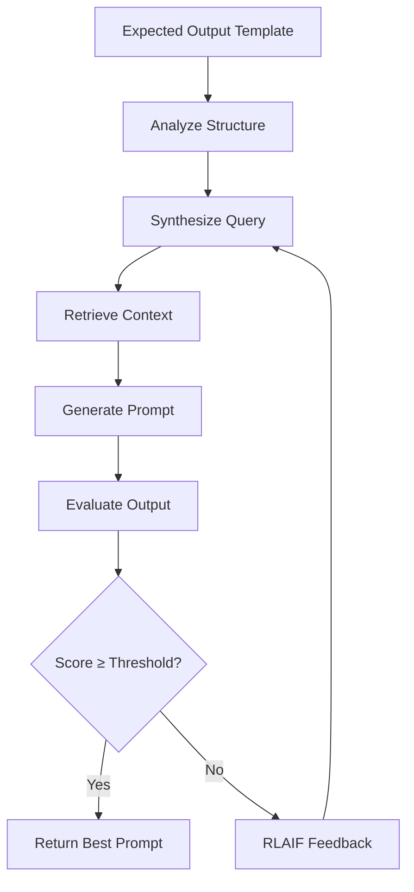

<div align="center">

# 🚀 AI Prompt Studio

### Reverse LLM Prompt Synthesis with RLAIF Optimization

[](https://python.org)
[](https://fastapi.tiangolo.com)
[](https://reactjs.org)
[](https://typescriptlang.org)
[](LICENSE)

*An intelligent prompt engineering platform that synthesizes optimal prompts from expected outputs*

[How It Works](#-reverse-llm-prompt-synthesis) • [Features](#-features) • [Installation](#-installation) • [Usage](#-usage) • [Architecture](#-architecture)

</div>

---

## 📋 Overview

AI Prompt Studio implements a novel approach called **Reverse LLM Prompt Synthesis** — instead of manually crafting prompts and hoping for the right output, you define your **expected output format first**, and the system automatically synthesizes the optimal prompt to achieve it.

Combined with **RLAIF (Reinforcement Learning from AI Feedback)**, the platform iteratively refines prompts through an AI-driven feedback loop until they consistently produce the desired output structure and quality.

---

## 🔄 Reverse LLM Prompt Synthesis

### The Problem with Traditional Prompt Engineering

```
Traditional Approach:
┌──────────────┐     ┌─────────────┐     ┌──────────────────┐
│ Write Prompt │ ──► │ Run LLM     │ ──► │ Check Output     │ ──► Repeat manually
│ (guesswork)  │     │             │     │ (trial & error)  │
└──────────────┘     └─────────────┘     └──────────────────┘
```

### Our Reverse Synthesis Approach

```
Reverse LLM Prompt Synthesis:
┌──────────────────┐     ┌───────────────────┐     ┌──────────────────┐
│ Define Expected  │ ──► │ AI Synthesizes    │ ──► │ Optimized Prompt │
│ Output Format    │     │ Optimal Prompt    │     │ (production-ready)│
└──────────────────┘     └───────────────────┘     └──────────────────┘
                                  │
                                  ▼
                    ┌─────────────────────────────┐
                    │   RLAIF Optimization Loop   │
                    │  • Query Design             │
                    │  • Context Retrieval        │
                    │  • Output Generation        │
                    │  • Evaluation & Scoring     │
                    │  • Feedback Refinement      │
                    └─────────────────────────────┘
```

### How It Works

| Step | Process | Description |
|------|---------|-------------|
| **1** | **Define Output Template** | Specify your exact desired output format (numbered lists, bullet points, structure) |
| **2** | **Analyze Format** | System detects structure patterns, placeholders, and formatting requirements |
| **3** | **Synthesize Query** | AI generates optimal retrieval queries based on output requirements |
| **4** | **Retrieve Context** | Vector search finds relevant document chunks using FAISS embeddings |
| **5** | **Generate Prompt** | Creates ChatML prompt designed to produce the expected output format |
| **6** | **Evaluate & Score** | AI evaluates if generated output matches expected structure |
| **7** | **Refine (RLAIF)** | Uses feedback to improve query and prompt design iteratively |
| **8** | **Select Best** | Returns the highest-scoring prompt across all iterations |

### Key Innovation

> **Traditional**: *"How do I write a prompt to get X?"*  
> **Reverse Synthesis**: *"This is X, synthesize the prompt that produces it."*

---

## ✨ Features

| Feature | Description |
|---------|-------------|
| 📄 **Multi-Format Document Upload** | Support for PDF, DOCX, TXT, and Markdown files |
| 🧠 **Vector Embeddings** | FAISS-powered semantic search for intelligent context retrieval |
| 🎯 **Template-Based Output** | Define exact output structure with placeholders or numbered formats |
| 🔄 **RLAIF Optimization Loop** | Iterative prompt refinement with AI-powered evaluation (3-5 iterations) |
| 📊 **Best Iteration Selection** | Automatically selects the highest-scoring iteration |
| 🧪 **Prompt Testing** | Test generated prompts directly in the UI |
| 📋 **ChatML Export** | Production-ready prompts in OpenAI-compatible JSON format |
| ⚙️ **Configurable LLM Settings** | Customize model, temperature, and max tokens |
| 📝 **Output Instructions** | Specify response style (concise, detailed, bullet points) |

---

## 🛠️ Installation

### Prerequisites

- Python 3.9+
- Node.js 18+
- OpenAI API key (or compatible API)

### Backend Setup

```bash
cd backend
python -m venv venv
source venv/bin/activate  # macOS/Linux
pip install -r requirements.txt
python run.py
```

Backend: `http://localhost:8000`

### Frontend Setup

```bash
cd frontend
npm install
npm run dev
```

Frontend: `http://localhost:5173`

---

## 🚀 Usage

### 1️⃣ Configure LLM
Click ⚙️ **Settings** → Enter API Key, Model, Temperature

### 2️⃣ Upload Documents
Drag & drop PDF, DOCX, TXT, or MD files

### 3️⃣ Define Expected Output
```
Required Technology Stack:
1. List of required software
2. List of required tools
3. Cloud or SaaS platforms
4. Other technical requirements
```

### 4️⃣ Add Output Instructions (Optional)
```
- Be concise and specific
- Use bullet points
- No citations
```

### 5️⃣ Generate & Test
Click **⚡ Generate Prompt** → **🧪 Test** → **💾 Export**

---

## 🏗️ Architecture

```
┌─────────────────────────────────────────────────────────────────┐
│                        AI Prompt Studio                          │
├─────────────────────────────────────────────────────────────────┤
│  Frontend (React + TypeScript + Vite)                           │
│  ├── Document Upload                                             │
│  ├── Expected Output Editor                                      │
│  ├── Optimization Progress                                       │
│  └── Prompt Result & Testing                                     │
├─────────────────────────────────────────────────────────────────┤
│  Backend (FastAPI + Python)                                      │
│  ├── Document Processor       - Parse multi-format documents    │
│  ├── Vector Store (FAISS)     - Semantic embeddings & search    │
│  ├── Query Designer           - Synthesize retrieval queries    │
│  ├── Evaluation LLM           - Score output quality            │
│  ├── RLAIF Optimizer          - Iterative refinement loop       │
│  └── ChatML Formatter         - OpenAI-compatible export        │
└─────────────────────────────────────────────────────────────────┘
```

### Reverse Synthesis Flow



---

## 📁 Project Structure

```
AIPromptStudio/
├── backend/
│   ├── app/
│   │   ├── api/routes/      # REST API endpoints
│   │   ├── models/          # Pydantic models
│   │   └── services/        # Core synthesis logic
│   │       ├── query_designer.py      # Query synthesis
│   │       ├── rlaif_optimizer.py     # RLAIF loop
│   │       ├── evaluation_llm.py      # Output scoring
│   │       └── chatml_formatter.py    # Prompt formatting
│   └── requirements.txt
├── frontend/
│   └── src/
│       ├── components/      # React UI components
│       └── services/        # API client
└── README.md
```

---

## 📡 API Reference

| Endpoint | Method | Description |
|----------|--------|-------------|
| `/api/config/llm` | GET/POST | Get/Update LLM configuration |
| `/api/documents/upload` | POST | Upload document for processing |
| `/api/prompts/optimize` | POST | Run Reverse LLM Prompt Synthesis |
| `/api/prompts/test` | POST | Test synthesized prompt |
| `/api/prompts/export` | POST | Export in ChatML format |

---

## ⚙️ Environment Variables

```env
# backend/.env
OPENAI_API_KEY=your_api_key
OPENAI_BASE_URL=https://api.openai.com/v1
LLM_MODEL=gpt-4
EMBEDDING_MODEL=text-embedding-ada-002
TEMPERATURE=0.7
MAX_TOKENS=2000
MIN_OPTIMIZATION_ITERATIONS=3
MAX_OPTIMIZATION_ITERATIONS=5
```

---

## 📄 License

MIT License - see [LICENSE](LICENSE)

---

<div align="center">

**Reverse LLM Prompt Synthesis** — *Define the output, synthesize the prompt*

⭐ **Star this repo if you find it useful!**

</div>
