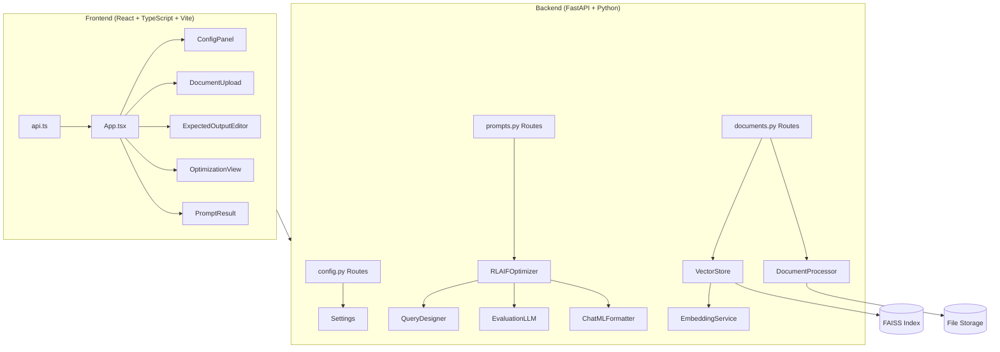
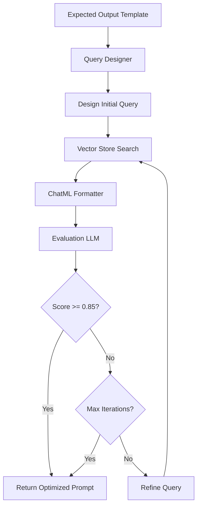

# AI Prompt Studio - Implementation Plan

## Project Overview

**AI Prompt Studio** is an intelligent prompt engineering platform that automates the creation of optimized, production-ready prompts for RAG (Retrieval-Augmented Generation) applications using RLAIF (Reinforcement Learning from AI Feedback) optimization.

---

## Architecture Overview



---

## Technology Stack

### Backend
| Component | Technology | Purpose |
|-----------|------------|---------|
| Framework | **FastAPI** | REST API with async support |
| Vector Store | **FAISS** | Semantic search & embeddings |
| LLM Integration | **OpenAI SDK** | GPT-4 and embedding models |
| Document Processing | **PyPDF2, python-docx** | PDF, DOCX parsing |
| Configuration | **Pydantic Settings** | Environment-based config |

### Frontend
| Component | Technology | Purpose |
|-----------|------------|---------|
| Framework | **React 18** | Component-based UI |
| Language | **TypeScript** | Type-safe development |
| Build Tool | **Vite** | Fast HMR and bundling |
| Styling | **CSS (Custom)** | Modern, responsive design |

---

## Backend Implementation

### Configuration Module
**File:** [config.py](file:///Users/A104794207/Desktop/Azam/Project%202025/AIPromptStudio/backend/app/config.py)

```python
class Settings(BaseSettings):
    # OpenAI Configuration
    openai_api_key: str
    openai_base_url: str = "https://api.openai.com/v1"
    llm_model: str = "gpt-4"
    embedding_model: str = "text-embedding-ada-002"
    temperature: float = 0.7
    max_tokens: int = 2000
    
    # Vector Store Configuration
    vector_store_path: str = "./data/vector_store"
    chunk_size: int = 500
    chunk_overlap: int = 50
    
    # RLAIF Configuration
    min_optimization_iterations: int = 3
    max_optimization_iterations: int = 5
```

---

### API Routes

#### 1. Configuration API
**File:** [routes/config.py](file:///Users/A104794207/Desktop/Azam/Project%202025/AIPromptStudio/backend/app/api/routes/config.py)

| Endpoint | Method | Description |
|----------|--------|-------------|
| `/api/config/llm` | GET | Get current LLM configuration |
| `/api/config/llm` | POST | Update LLM configuration |
| `/api/config/test-connection` | POST | Test connection to LLM |
| `/api/config/optimization` | GET | Get optimization settings |

#### 2. Documents API
**File:** [routes/documents.py](file:///Users/A104794207/Desktop/Azam/Project%202025/AIPromptStudio/backend/app/api/routes/documents.py)

| Endpoint | Method | Description |
|----------|--------|-------------|
| `/api/documents/upload` | POST | Upload and process document |
| `/api/documents/` | GET | List all documents |
| `/api/documents/{id}` | GET | Get specific document |
| `/api/documents/{id}` | DELETE | Delete document and embeddings |
| `/api/documents/` | DELETE | Clear all documents |
| `/api/documents/stats` | GET | Get vector store statistics |

**Supported File Types:** PDF, DOCX, DOC, TXT, MD, Markdown

#### 3. Prompts API
**File:** [routes/prompts.py](file:///Users/A104794207/Desktop/Azam/Project%202025/AIPromptStudio/backend/app/api/routes/prompts.py)

| Endpoint | Method | Description |
|----------|--------|-------------|
| `/api/prompts/optimize` | POST | Run RLAIF optimization |
| `/api/prompts/analyze` | POST | Analyze expected output template |
| `/api/prompts/export` | POST | Export prompt in OpenAI format |
| `/api/prompts/test` | POST | Test prompt with LLM |

---

### Core Services

#### 1. Document Processor
**File:** [services/document_processor.py](file:///Users/A104794207/Desktop/Azam/Project%202025/AIPromptStudio/backend/app/services/document_processor.py)

- Parses PDF, DOCX, TXT, and Markdown files
- Chunks documents with configurable size and overlap
- Returns `Document` and `DocumentChunk` models

#### 2. Vector Store (FAISS)
**File:** [services/vector_store.py](file:///Users/A104794207/Desktop/Azam/Project%202025/AIPromptStudio/backend/app/services/vector_store.py)

```python
class VectorStore:
    def add_chunks(self, chunks: List[DocumentChunk]) -> int
    def search(self, query: str, top_k: int = 5) -> List[RetrievedContext]
    def delete_document(self, document_id: str) -> int
    def clear(self) -> None
    def get_stats(self) -> dict
```

- Persists index and metadata to disk
- Supports document-level filtering
- Returns relevance scores with results

#### 3. Embedding Service
**File:** [services/embedding_service.py](file:///Users/A104794207/Desktop/Azam/Project%202025/AIPromptStudio/backend/app/services/embedding_service.py)

- OpenAI-compatible embedding generation
- Configurable model selection
- Hot-reload configuration support

#### 4. RLAIF Optimizer
**File:** [services/rlaif_optimizer.py](file:///Users/A104794207/Desktop/Azam/Project%202025/AIPromptStudio/backend/app/services/rlaif_optimizer.py)



**Optimization Loop:**
1. Analyzes expected output template
2. Designs initial query based on template
3. Retrieves relevant context from vector store
4. Creates ChatML format prompt
5. Generates output and evaluates against expected
6. Refines query based on feedback (min 3 iterations)
7. Returns best prompt when score >= 0.85 or max iterations reached

#### 5. Query Designer
**File:** [services/query_designer.py](file:///Users/A104794207/Desktop/Azam/Project%202025/AIPromptStudio/backend/app/services/query_designer.py)

- Analyzes template placeholders and structure
- Designs initial queries using LLM
- Refines queries based on evaluation feedback

#### 6. Evaluation LLM
**File:** [services/evaluation_llm.py](file:///Users/A104794207/Desktop/Azam/Project%202025/AIPromptStudio/backend/app/services/evaluation_llm.py)

**Root Cause Categories:**
- `context_missing` - Information not in retrieved context
- `terminology_mismatch` - Query uses different terms
- `structure_mismatch` - Output format doesn't match
- `ambiguity` - Query or expected output is unclear
- `retrieval_quality` - Poor chunk retrieval

#### 7. ChatML Formatter
**File:** [services/chatml_formatter.py](file:///Users/A104794207/Desktop/Azam/Project%202025/AIPromptStudio/backend/app/services/chatml_formatter.py)

- Creates OpenAI ChatML format prompts
- Builds system messages with format instructions
- Exports to OpenAI API compatible JSON

---

### Data Models

#### Document Models
**File:** [models/document.py](file:///Users/A104794207/Desktop/Azam/Project%202025/AIPromptStudio/backend/app/models/document.py)

```python
class Document
class DocumentChunk
class DocumentUploadResponse
class DocumentListResponse
class RetrievedContext
```

#### Prompt Models
**File:** [models/prompt.py](file:///Users/A104794207/Desktop/Azam/Project%202025/AIPromptStudio/backend/app/models/prompt.py)

```python
class ExpectedOutput
class ChatMLRole (Enum)
class ChatMLMessage
class ChatMLPrompt
class EvaluationResult
class OptimizationIteration
class PromptOptimizationRequest
class PromptOptimizationResponse
```

#### Evaluation Models
**File:** [models/evaluation.py](file:///Users/A104794207/Desktop/Azam/Project%202025/AIPromptStudio/backend/app/models/evaluation.py)

```python
class PlaceholderInfo
class TemplateAnalysis
class ContextQualityAssessment
```

---

## Frontend Implementation

### Main Application
**File:** [App.tsx](file:///Users/A104794207/Desktop/Azam/Project%202025/AIPromptStudio/frontend/src/App.tsx)

**State Management:**
- `llmConfig` - Current LLM configuration
- `documents` - Uploaded documents list
- `isOptimizing` - Optimization in progress flag
- `optimizationResult` - RLAIF optimization result
- `error` - Error messages
- `showConfig` - Settings panel visibility

### Components

| Component | Purpose |
|-----------|---------|
| **ConfigPanel** | LLM API key, model, and settings configuration |
| **DocumentUpload** | File upload with drag-drop, document list management |
| **ExpectedOutputEditor** | Template editor with placeholder support |
| **OptimizationView** | Real-time optimization progress display |
| **PromptResult** | Final prompt display with export options |

### API Service
**File:** [api.ts](file:///Users/A104794207/Desktop/Azam/Project%202025/AIPromptStudio/frontend/src/services/api.ts)

**Exported Functions:**
- `getLLMConfig()` / `updateLLMConfig()` / `testConnection()`
- `listDocuments()` / `uploadDocument()` / `deleteDocument()` / `clearAllDocuments()`
- `analyzeTemplate()` / `optimizePrompt()` / `exportPrompt()` / `testPrompt()`

---

## Project Structure

```
AIPromptStudio/
├── README.md
├── backend/
│   ├── run.py                    # Application entry point
│   ├── requirements.txt
│   ├── .env.example
│   ├── data/
│   │   ├── uploads/              # Uploaded documents
│   │   └── vector_store/         # FAISS index
│   └── app/
│       ├── __init__.py
│       ├── main.py
│       ├── config.py             # Settings management
│       ├── api/
│       │   ├── __init__.py
│       │   └── routes/
│       │       ├── config.py     # LLM configuration endpoints
│       │       ├── documents.py  # Document management endpoints
│       │       └── prompts.py    # Prompt optimization endpoints
│       ├── models/
│       │   ├── document.py       # Document data models
│       │   ├── prompt.py         # Prompt data models
│       │   └── evaluation.py     # Evaluation data models
│       └── services/
│           ├── chatml_formatter.py
│           ├── document_processor.py
│           ├── embedding_service.py
│           ├── evaluation_llm.py
│           ├── query_designer.py
│           ├── rlaif_optimizer.py
│           └── vector_store.py
├── frontend/
│   ├── index.html
│   ├── package.json
│   ├── tsconfig.json
│   ├── vite.config.ts
│   └── src/
│       ├── App.tsx
│       ├── main.tsx
│       ├── components/
│       │   ├── ConfigPanel/
│       │   ├── DocumentUpload/
│       │   ├── ExpectedOutputEditor/
│       │   ├── OptimizationView/
│       │   └── PromptResult/
│       ├── services/
│       │   └── api.ts
│       └── styles/
│           └── App.css
└── documents/
    └── Implementation_Plan.md
```

---

## Environment Configuration

### Backend (.env)
```env
OPENAI_API_KEY=your_openai_api_key
OPENAI_BASE_URL=https://api.openai.com/v1
LLM_MODEL=gpt-4
EMBEDDING_MODEL=text-embedding-ada-002
TEMPERATURE=0.7
MAX_TOKENS=2000
CHUNK_SIZE=500
CHUNK_OVERLAP=50
MIN_OPTIMIZATION_ITERATIONS=3
MAX_OPTIMIZATION_ITERATIONS=5
```

---

## Quick Start

### Backend
```bash
cd backend
python -m venv venv
source venv/bin/activate  # Windows: venv\Scripts\activate
pip install -r requirements.txt
python run.py
```
Server runs on `http://localhost:5000`

### Frontend
```bash
cd frontend
npm install
npm run dev
```
Application runs on `http://localhost:5173`

---

## Key Features Implemented

- ✅ **Document Upload**: PDF, DOCX, TXT, Markdown support
- ✅ **Vector Embeddings**: FAISS-powered semantic search
- ✅ **Generic Templates**: Expected output with placeholder detection
- ✅ **RLAIF Optimization**: Iterative prompt refinement (min 3 iterations)
- ✅ **ChatML Export**: Production-ready prompts in OpenAI format
- ✅ **Template Analysis**: Automatic placeholder and structure detection
- ✅ **Hot-Reload Config**: Runtime LLM configuration updates
- ✅ **Clear Index**: Reset document index capability

---

*Last Updated: December 26, 2025*
